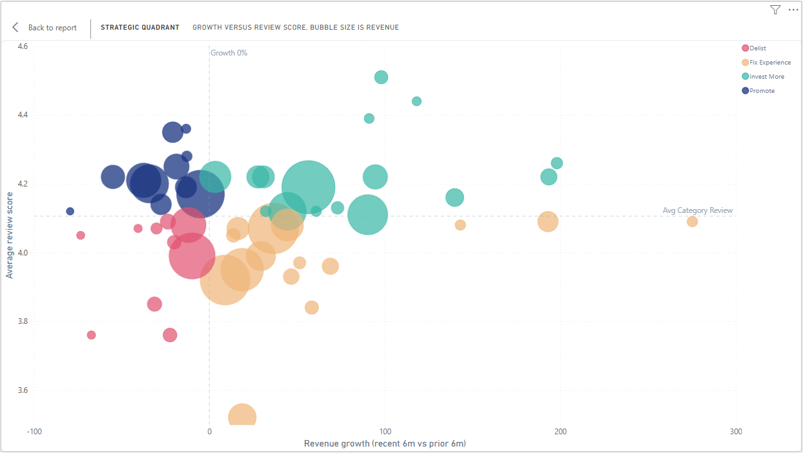
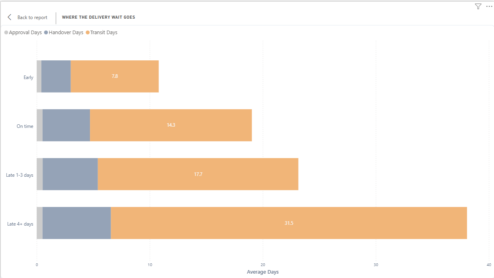
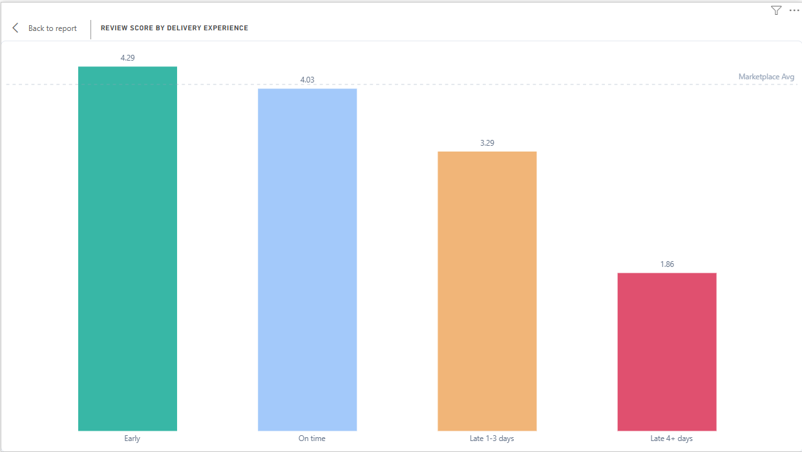
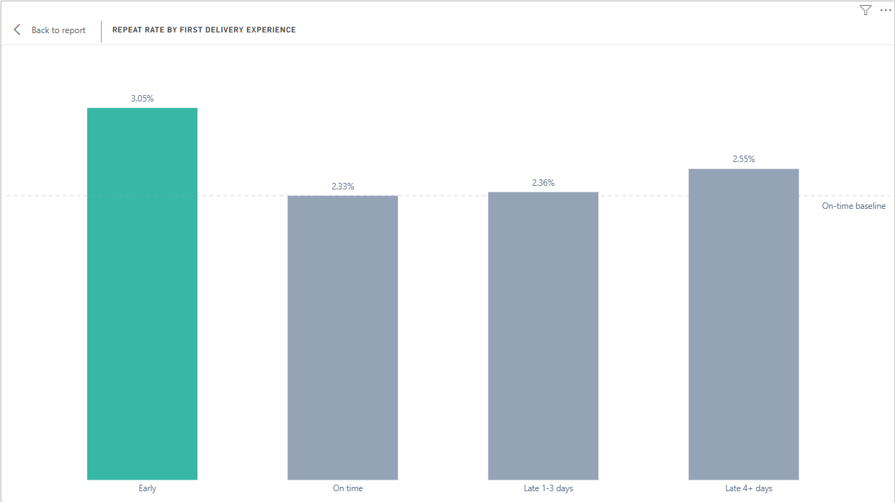
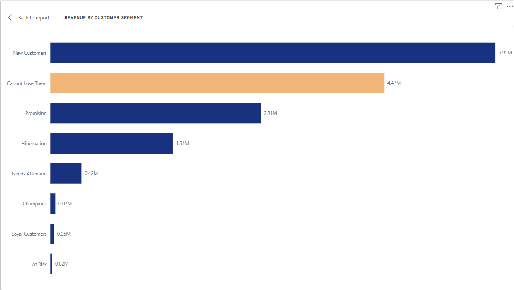
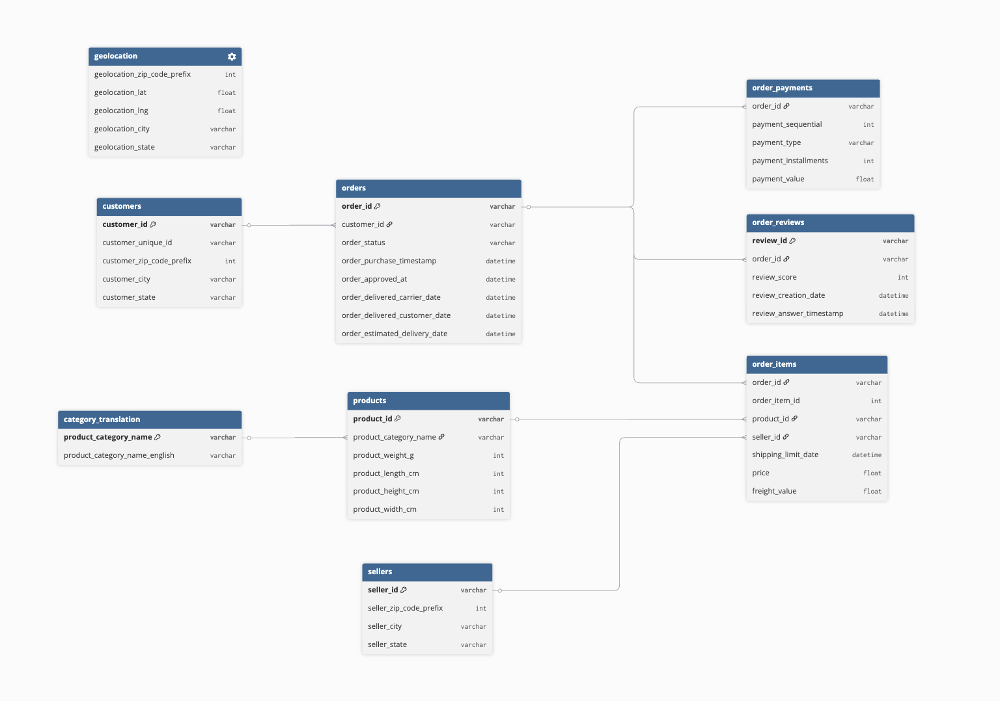
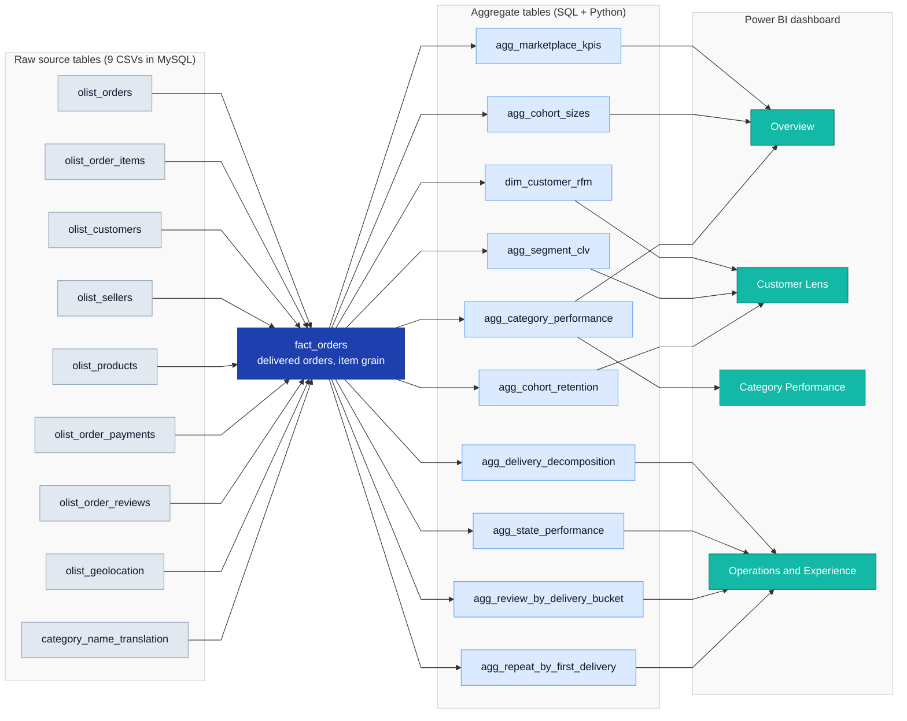

# Olist Marketplace: Customer and Commercial Analytics
*A commercial deep-dive into a Brazilian e-commerce marketplace with 96K delivered orders across 73 categories and 27 states, identifying retention, category, and operational priorities for merchandising and operations leadership.*

## Project Overview
This project simulates a commercial analyst engagement for an e-commerce marketplace, using Olist's publicly available transaction data from September 2016 to August 2018. The project examines Olist's marketplace from four angles, including customer retention, category prioritisation, delivery operations, and operational drivers of repeat purchase. The analysis covers 96K delivered orders, 93K customers, and 27 Brazilian states. The outputs are a recommendations memo for marketplace leadership and a Power BI dashboard for ongoing monitoring. 

## Key Findings
- **35% of marketplace revenue sits in growing categories that are rated below average.** Four categories (bed_bath_table, watches_gifts, furniture_decor, office_furniture) carry the bulk of this exposure and represent the highest commercial leverage identified.



- **Late delivery is fundamentally a carrier problem, not a seller problem.** Carrier transit accounts for 74% of customer wait time, and the gap between on-time and severely-late deliveries is driven entirely by this phase.



When delivery is severely late, satisfaction collapses. Average review falls from 4.29 for early orders to 1.86 for orders 4+ days late.



- **Olist's customers do not punish lateness; they reward early delivery.** Repeat purchase rates lift 31% when first deliveries arrive early, but show no decline when they arrive late.



- **The most valuable customer segment is now dormant.** 15.5% of customers who historically drove 29% of revenue currently sit in the "Cannot Lose Them" RFM segment with no active engagement.



## Methodology
The analysis proceeds in four phases:

1. **Data preparation**: 9 raw CSVs were loaded into MySQL via `pandas.to_sql`, then aggregated and joined into a `fact_orders` table using SQL. This table is the analytical foundation for all downstream notebooks. 
2. **Customer analytics**: Customers are analysed through RFM segmentation, historic CLV, and cohort retention to identify the most valuable segment and the structural nature of repeat behaviour.
3. **Category performance**: 73 categories are aggregated from `fact_orders` and compared on revenue growth (recent 6 months vs prior 6 months), then plotted as a strategic quadrant of growth versus customer satisfaction. 
4. **Operations and experience**: Four sub-analyses examine delivery time decomposition, the review-score cost of late delivery, geographic patterns in customer experience, and the relationship between first delivery and repeat purchase.

Each phase produces an aggregated table in MySQL, consumed by both the recommendations memo and the Power BI dashboard.

## Data Model
The Olist dataset consists of nine related tables. `orders` sits at the centre, linking to  `customers` by `customer_id` and to `order_payments`, `order_reviews`, and `order_items` by `order_id`. Each row of `order_items` ties an order to its `products` (via `product_id`) and `sellers` (via `seller_id`), and `products` joins to `category_translation` on `product_category_name` to resolve English category names. 



*Olist source schema. Crow's-foot ends mark the "many" side of each relationship. `geolocation` is shown standalone because it links to `customers` and `sellers` only by `zip_code_prefix`, which is not a unique key.*

These nine tables are joined and flattened into a single `fact_orders` table at order-item grain, filtered to delivered orders, which becomes the analytical foundation for every notebook and the aggregated tables behind the dashboard. That build is shown in the [Data Flow](#data-flow) section below. 

## Data Flow

The nine raw CSVs are loaded into MySQL and joined into a single denormalised `fact_orders` table at order-item grain, filtered to delivered orders. SQL and Python then build purpose-built aggregate tables from `fact_orders`, one per analysis, which feed the four pages of the Power BI dashboard.



## Tech Stack
- **Python (pandas, sqlalchemy, matplotlib, seaborn)**: Analytical work, statistical computations, and chart generation.
- **MySQL**: Data warehouse hosting raw tables, the analytical fact table, and aggregated outputs.
- **MySQL Workbench**: SQL development with autocomplete, query inspection, and result preview.
- **Power BI**: Interactive dashboard consuming the MySQL aggregated tables for marketplace monitoring.
- **Jupyter Lab**: Development environment for notebooks 01-04.

## Repository Structure

```text
olist_commercial_analytics/
├── README.md
├── requirements.txt
├── metric_reconciliation.md               # canonical-value decisions for dual metrics
│
├── 01_sql_fact_table.ipynb                # load raw CSVs to MySQL, build fact_orders
├── 02_customer_analytics.ipynb            # RFM, historic CLV, cohort retention
├── 03_category_performance.ipynb          # category growth vs review quadrant
├── 04_operations_experience.ipynb         # delivery, reviews, geography, repeat purchase
│
├── sql/
│   ├── 01_fact_table.sql
│   ├── 02_category_aggregates.sql
│   └── 03_delivery_aggregates.sql
│
├── data/
│   ├── raw/                               # 9 source CSVs from Kaggle
│   └── processed/
│       ├── fact_orders.parquet            # central fact table (+ .csv)
│       ├── rfm_segments.parquet           # customer-level RFM (+ .csv)
│       ├── rfm_clv.parquet                # RFM + historic CLV (+ .csv)
│       ├── category_full.parquet
│       ├── cohort_retention.csv
│       └── dashboard_inputs/              # 9 aggregate tables feeding Power BI
│
├── dashboard/
│   └── olist_dashboard.pbix               # 4-page Power BI dashboard
│
├── report/
│   └── commercial_recommendations.md      # recommendations memo
│
├── image/                                 # dashboard screenshots + ERD used in README
│
└── archive/
    └── 01_setup_and_eda_pandas_only.ipynb # superseded pandas-only EDA
```

## How to Run
### Requirements

- Python 3.11 or higher (developed on Python 3.13)
- MySQL Server 8.0 or higher (running on localhost:3306)
- MySQL Workbench (optional, for SQL inspection)
- Power BI Desktop (for the dashboard)
- Approximately 200MB of disk space for the dataset and intermediate files

### Setup

1. Clone this repository:
```bash
   git clone https://github.com/joanne-thai/olist_commercial_analytics.git
   cd olist_commercial_analytics
```

2. Install Python dependencies:
```bash
   pip install -r requirements.txt
```

3. Download the Olist dataset from Kaggle: https://www.kaggle.com/datasets/olistbr/brazilian-ecommerce
    Place the 9 CSV files in `data/raw/`.

4. Create the `olist` database in MySQL:
```sql
   CREATE DATABASE olist;
```

5. Update connection credentials in each notebook (currently set to localhost with a placeholder password).

### Execution 

1. Run `01_setup_and_eda.ipynb` to load the 9 raw CSVs into MySQL.
2. Execute `sql/01_fact_table.sql` in MySQL Workbench to build the `fact_orders` table.
3. Run notebooks 02-04 in order. Each phase consumes the outputs of the previous and writes its own aggregated tables back to MySQL.
4. Open the Power BI dashboard in `dashboard/` to interact with the analytical outputs. 

Estimated total runtime: ~5-10 minutes once dependencies are installed. 

## About the Dataset

The Olist Brazilian E-Commerce Public Dataset is published by Olist on Kaggle and covers approximately 99,000 marketplace transactions from September 2016 to August 2018. The dataset consists of 9 CSV files representing orders, order items, customers, sellers, products, payments, reviews, geolocation, and category translations. Linked via `order_id`, `customer_id`, and `product_id`, these tables reconstruct the full transaction lifecycle from purchase to delivery to review. The data is anonymised but commercially representative. It reflects a real marketplace's actual transactions, complete with delivery delays, customer reviews, and seller behaviour. 

Source: [Brazilian E-Commerce Public Dataset by Olist on Kaggle](https://www.kaggle.com/datasets/olistbr/brazilian-ecommerce).

## Limitations
A few honest caveats about this analysis:

- **Dataset age.** The data covers September 2016 to August 2018. Brazilian e-commerce has evolved significantly since then, and specific category and geographic findings may not generalise to current Olist marketplace conditions. 
- **No margin or cost data.** All metrics are revenue-based. Category prioritisation and recommendations could differ if margin data were available, since high-revenue categories are not always high-margin ones. 
- **Customer-service data unavailable.** The Phase 4 retention finding (that late deliveries do not reduce repeat purchase) is potentially confounded by customer-service recovery efforts such as refunds and free shipping codes. Without CS interaction data, this hypothesis cannot be tested. 
- **Two untranslated category names.** Two product categories retained their original Portuguese names due to gaps in the category translation table. Combined, these account for less than 0.1% of marketplace revenue, so the impact on findings is negligible.
- **Single growth window.** The category growth metric in Phase 3 used one 6-month window compared to the prior 6 months. Categories with strong seasonality may show artefacts that a year-over-year comparison would smooth out. 

## Contact
Joanne Thai
- Email: [joannethai.work@gmail.com](mailto:joannethai.work@gmail.com)
- LinkedIn: [linkedin.com/in/joannethaii](https://www.linkedin.com/in/joannethaii)

For data analyst roles, portfolio reviews, or general feedback on this project. 
